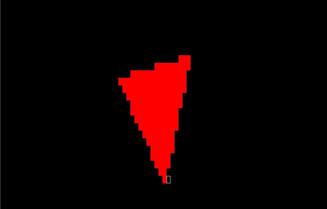
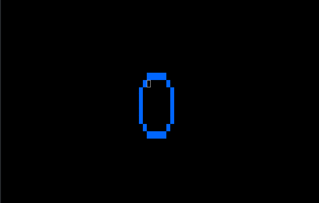
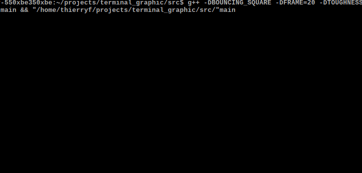

# Terminal Graphic


>A small C++ terminal renderer that draws simple geometric shapes using a custom scene system.

The program simulates basic animations such as 
rotating triangles, pulsing circles, and bouncing squares directly in the terminal.

The goal of the project is to experiment with software rendering, vector math, and frame-based simulation without relying on external graphics libraries.

---

## Features:

- ASCII / terminal rendering

- Simple 2D vector math

- Basic shapes:

- Triangles

- Circles

- Squares


## Animation examples:

- Rotating triangle

- Pulsing circle

- Bouncing square with gravity

- Compile-time configuration using macros

- Fixed frame timing

---

## Project Structure
```
.
├── makefile
└── src
    ├── main.cpp      # program entry point
    ├── scene.cpp     # rendering logic
    ├── scene.h
    ├── vec.cpp    #vector math implementation
    ├── vec.h
```
---

## Requirements

- C++17 compatible compiler
- g++ or clang
- make

---

## Build

### Compile the project:
```terminal
make
```
This produces the executable:

src/main


---

## Run
```
make run
```
or
```
./src/main
```

---

## Compile-Time Options

The program uses preprocessor macros to enable different animations or change physics parameters.

### Enable animations

-DROTATING_TRIANGLE
-DCIRCLE
-DBOUNCING_SQUARE

Example:
```
make CXXFLAGS="-std=c++17 -DROTATING_TRIANGLE"
```

---

## Physics parameters

These values can be changed during compilation:

| Macro     | Description                        | Example         |   |   |
|-----------|------------------------------------|-----------------|---|---|
| GRAVITY   | gravity applied to bouncing square | -DGRAVITY=0.5   |   |   |
| FRAME     | frames per second                  | -DFRAME=30      |   |   |
| TOUGHNESS | bounce energy retention            | -DTOUGHNESS=0.9 |   |   |


Example:
```
make CXXFLAGS="-std=c++17 -DBOUNCING_SQUARE -DGRAVITY=0.7 -DFRAME=30"
```

---

## How It Works

The program runs a main loop:

- 1. Update object positions

- 2. Draw shapes to the scene

- 3. Render the frame

- 4. Wait until the frame duration is reached


Frame timing is controlled using:

- std::chrono

- std::thread::sleep_for


This creates a stable frame rate simulation.


---

## Learning Goals

This project is designed to explore:

- Basic software rendering

- Vector math for geometry

- Animation loops

- Simple physics simulation

- C++ modular design

## License
This project is licensed under the MIT License.
